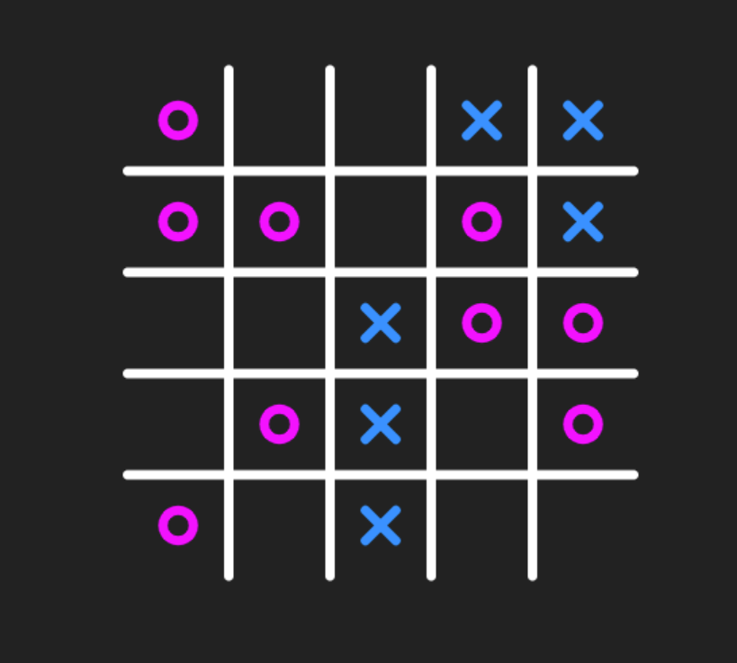

# Tic-Tac-Toe in JavaScript



## Configuration

```TypeScript
export const CELL_SIZE = 75;
export const CELL_COUNT = 5;

export const SYMBOL_SIZE = (
    (CELL_SIZE - CELL_SIZE * 0.7) / 2
);

export const LINE_WIDTH = 7;

export const O_COLOR = 'magenta';
export const X_COLOR = 'dodgerblue';

export const LINE_COLOR = '#fff';
export const BACKGROUND_COLOR = '#222';
```

## Generated Snipped

```TypeScript
const constrain = CELL_COUNT * Math.floor(CELL_COUNT * 0.7);

for (let index = 0; index < constrain; index++) {
    let x = rand(CELL_COUNT);
    let y = rand(CELL_COUNT);

    while (cords.some(a => a[0] === x && a[1] === y)) {
        x = rand(CELL_COUNT);
        y = rand(CELL_COUNT);
    }

    cords.push([x, y]);

    if (randBool()) {
        draw(ctx, drawX(x, y));        
    } else {
        draw(ctx, drawO(x, y));
    }
}
```